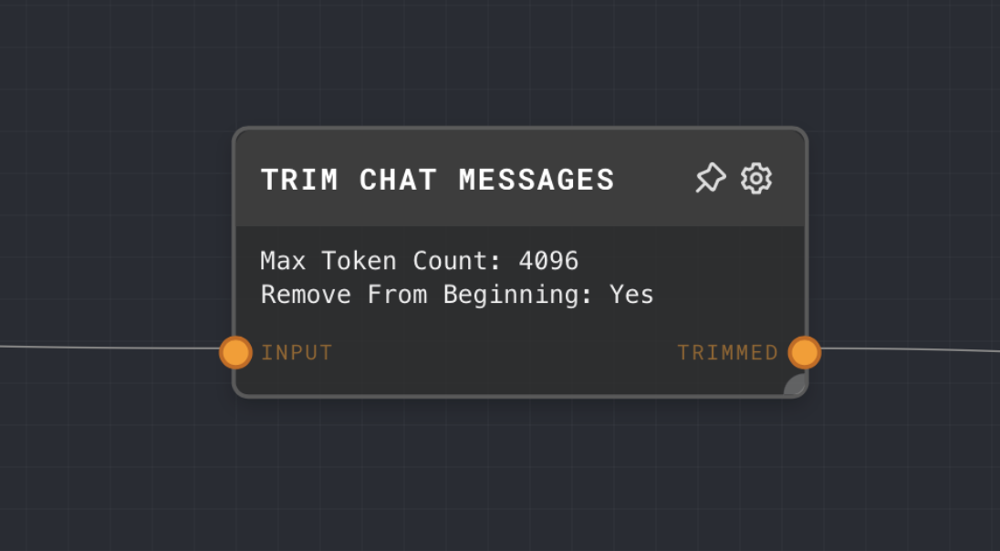
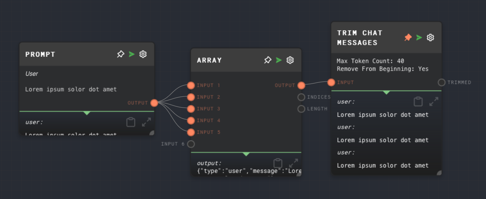

import Tabs from '@theme/Tabs';
import TabItem from '@theme/TabItem';

## Overview

The Trim Chat Messages Node is used to manage the length of chat message chains in terms of tokens. It takes an array of chat messages and trims messages from either the beginning or the end of the list until the total length of the messages is under the configured token length. This is particularly useful for setting up infinite message chains that stay under the language model's context limit.

<Tabs
  defaultValue="inputs"
  values={[
    {label: 'Inputs', value: 'inputs'},
    {label: 'Outputs', value: 'outputs'},
    {label: 'Editor Settings', value: 'settings'},
  ]
}>

<TabItem value="inputs">

## Inputs

| Title | Data Type      | Description                        | Default Value | Notes |
| ----- | -------------- | ---------------------------------- | ------------- | ----- |
| Input | `chat-message[]` | The array of chat messages to trim. | (required)    |       |

</TabItem>

<TabItem value="outputs">

## Outputs

| Title   | Data Type      | Description                                                                                           | Notes |
| ------- | -------------- | ----------------------------------------------------------------------------------------------------- | ----- |
| Trimmed | `chat-message[]` | The array of chat messages after being trimmed to fit within the configured maximum token count. |       |

</TabItem>

<TabItem value="settings">

## Editor Settings

| Setting          | Description                                                                                                                   | Default Value | Use Input Toggle | Input Data Type |
| ---------------- | ----------------------------------------------------------------------------------------------------------------------------- | ------------- | ---------------- | --------------- |
| Max Token Count  | The maximum token count for the total length of the chat messages.                                                            | 4096          | No               | `number`        |
| Remove From Beginning | If enabled, messages will be removed from the beginning of the list. If disabled, messages will be removed from the end. | true          | No               | N/A             |

</TabItem>

</Tabs>

## Example 1: Trim a long chat message chain

1. Create an [Array Node](./array.mdx) and set the value to an array of chat messages that exceeds a certain token count.
2. Create a Trim Chat Messages Node and connect the Array Node to its `Input` port. Set the `Max Token Count` to a value lower than the total token count of the chat messages.
3. Run the graph. The `Trimmed` output of the Trim Chat Messages Node should contain an array of chat messages with a total token count that does not exceed the configured `Max Token Count`.

   

## Error Handling

The Trim Chat Messages Node does not have any notable error handling behavior. If the input is not an array of chat messages, it will be coerced into one.

## FAQ

**Q: What happens if the `Max Token Count` is set to a value lower than the token count of a single chat message?**

A: The Trim Chat Messages Node will keep removing messages until the total token count is under the `Max Token Count`. If a single chat message exceeds the `Max Token Count`, the `Trimmed` output will be an empty array.

**Q: Can I use the Trim Chat Messages Node to trim an array of strings or other data types?**

A: No, the Trim Chat Messages Node is specifically designed to work with arrays of chat messages. If you need to trim an array of other data types, you may need to use a different node or a custom solution.

## See Also

- [Array Node](./array.mdx)
- [Chat Node](./chat.mdx)
- [Extract JSON Node](./extract-json.mdx)
- [Extract Object Path Node](./extract-object-path.mdx)
- [Code Node](./code.mdx)