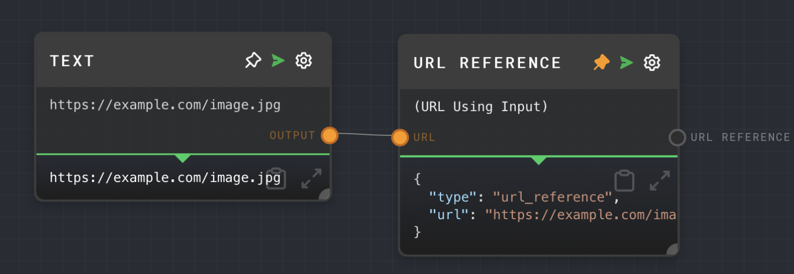

import Tabs from '@theme/Tabs';
import TabItem from '@theme/TabItem';

## Overview

The URL Reference Node is used to define a reference to a URL or convert a string into a URL reference. This node is particularly useful when used with the Assemble Message node to define URLs for attachments or images, allowing the LLM to download the image instead of having to upload the image with your chat request.

<Tabs
  defaultValue="inputs"
  values={[
    {label: 'Inputs', value: 'inputs'},
    {label: 'Outputs', value: 'outputs'},
    {label: 'Editor Settings', value: 'settings'},
  ]
}>

<TabItem value="inputs">

## Inputs

| Title | Data Type | Description                                      | Default Value | Notes                                                                   |
| ----- | --------- | ------------------------------------------------ | ------------- | ----------------------------------------------------------------------- |
| URL   | `string`  | The string to be converted into a URL reference. | (empty)       | This input is only available if the `Use URL Input` setting is enabled. |

</TabItem>

<TabItem value="outputs">

## Outputs

| Title         | Data Type | Description                       | Notes |
| ------------- | --------- | --------------------------------- | ----- |
| URL Reference | `object`  | A reference to the specified URL. | None  |

</TabItem>

<TabItem value="settings">

## Editor Settings

| Setting       | Description                                                 | Default Value | Use Input Toggle | Input Data Type |
| ------------- | ----------------------------------------------------------- | ------------- | ---------------- | --------------- |
| URL           | The URL to be converted into a URL reference.               | (empty)       | Yes              | `string`        |
| Use URL Input | If enabled, the URL can be provided via the URL input port. | False         | No               | N/A             |

</TabItem>

</Tabs>

## Example 1: Define a URL Reference

1. Create a URL Reference Node.
2. Set the `URL` setting to the URL you want to reference (e.g., `https://example.com/image.jpg`).
3. Run the graph. The `URL Reference` output of the URL Reference Node should contain a reference to the specified URL.

## Example 2: Convert a String into a URL Reference

1. Create a URL Reference Node and enable the `Use URL Input` setting.
2. Create a [Text Node](./text.mdx) and set the text to the URL you want to reference (e.g., `https://example.com/image.jpg`).
3. Connect the Text Node to the `URL` input of the URL Reference Node.
4. Run the graph. The `URL Reference` output of the URL Reference Node should contain a reference to the specified URL.

## Error Handling

The URL Reference Node cannot error under normal circumstances. If the `URL` input is not provided, the node will use the URL specified in the settings.

## FAQ

**Q: Can I use the URL Reference Node to reference a file on my local machine?**

A: No, the URL Reference Node is intended for referencing URLs on the internet. If you want to reference a file on your local machine, you would need to upload the file to a web server and reference the URL of the uploaded file, or use the Image Node to load the image from your local machine.

**Q: What happens if I provide an invalid URL?**

A: The URL Reference Node does not validate the URL. It simply creates a reference to the provided URL. If the URL is invalid, any nodes that use the URL reference may fail or behave unexpectedly.

## See Also

- [Assemble Message Node](./assemble-message.mdx)
- [Text Node](./text.mdx)
- [HTTP Call Node](./http-call.mdx)
- [Image Node](./image.mdx)
