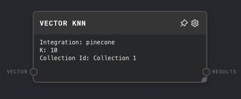
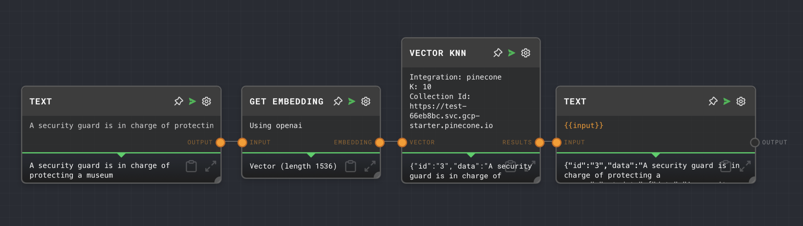

# Vector Nearest Neighbors Node

import Tabs from '@theme/Tabs';
import TabItem from '@theme/TabItem';

## Overview

The Vector KNN Node takes a vector embedding and searches for K similar vectors.

## Overview

The Vector K-Nearest Neighbors (KNN) Node is used to perform a k-nearest neighbors search on vectors stored in a configured vector database integration. It takes in a vector and returns the k closest vectors and their corresponding data.

This node is useful when working with vector databases such as Pinecone, where you might want to find the vectors in the database that are most similar to a given input vector.

<Tabs
  defaultValue="inputs"
  values={[
    {label: 'Inputs', value: 'inputs'},
    {label: 'Outputs', value: 'outputs'},
    {label: 'Editor Settings', value: 'settings'},
  ]
}>

<TabItem value="inputs">

## Inputs

| Title         | Data Type | Description                                                                                           | Default Value | Notes                                                                                                                            |
| ------------- | --------- | ----------------------------------------------------------------------------------------------------- | ------------- | -------------------------------------------------------------------------------------------------------------------------------- |
| Vector        | `vector`  | The vector to find the nearest neighbors for.                                                         | (required)    | The input will be coerced into a vector if it is not a vector.                                                                   |
| Integration   | `string`  | The name of the vector database integration to use.                                                   | (optional)    | Only required if `Use Integration Input` is enabled in the editor settings.                                                      |
| K             | `number`  | The number of nearest neighbors to find.                                                              | (optional)    | Only required if `Use K Input` is enabled in the editor settings.                                                                |
| Collection ID | `string`  | The ID of the collection in the vector database to search for the nearest neighbors.                  | (optional)    | Only required if `Use Collection ID Input` is enabled in the editor settings.                                                     |

</TabItem>

<TabItem value="outputs">

## Outputs

| Title   | Data Type | Description                                                                                   | Notes                                                                                      |
| ------- | --------- | --------------------------------------------------------------------------------------------- | ------------------------------------------------------------------------------------------ |
| Results | `any[]`   | The k nearest neighbors to the input vector, along with their corresponding data.             | If the value is not found, this port is not ran.                                          |

</TabItem>

<TabItem value="settings">

## Editor Settings

| Setting               | Description                                                                                                                                        | Default Value | Use Input Toggle | Input Data Type |
| --------------------- | -------------------------------------------------------------------------------------------------------------------------------------------------- | ------------- | ---------------- | --------------- |
| Integration           | The name of the vector database integration to use.                                                                                                | (empty)       | Yes              | `string`        |
| K                     | The number of nearest neighbors to find.                                                                                                           | 10            | Yes              | `number`        |
| Collection ID         | The ID of the collection in the vector database to search for the nearest neighbors.                                                               | (empty)       | Yes              | `string`        |

</TabItem>

</Tabs>

## Example 1: Find the nearest neighbors of a vector in a Pinecone database

1. Create a [Text Node](./text.mdx) with the text you want to search for nearest neighbors of. 
2. Connect the Text Node to a [Get Embedding Node](./get-embedding) to convert the text into a vector.
3. Create a Vector KNN Node and connect the Vector Node to its `Vector` input. Set the `Integration` to `pinecone`, the `K` to `10`, and the `Collection ID` to the ID of your Pinecone collection.
4. Run the graph. The Vector KNN Node should output the 10 nearest neighbors to the input vector in the Pinecone collection.

## Error Handling

The Vector KNN Node will throw an error if the input vector is not a vector, or if the specified vector database integration is not found. If the specified collection ID is not found in the vector database, the node will return an empty array.

## FAQ

**Q: Can I use the Vector KNN Node with other vector database integrations?**

A: Yes, you can use the Vector KNN Node with any vector database integration supported by Rivet, such as Pinecone. You just need to specify the name of the integration in the `Integration` setting of the node.

**Q: Can I find the nearest neighbors of multiple vectors at once?**

A: No, the Vector KNN Node can only find the nearest neighbors of a single vector at a time. If you want to find the nearest neighbors of multiple vectors, you would need to use multiple Vector KNN Nodes, one for each vector.

## See Also

- [Pinecone](../user-guide/plugins/built-in/pinecone.md)