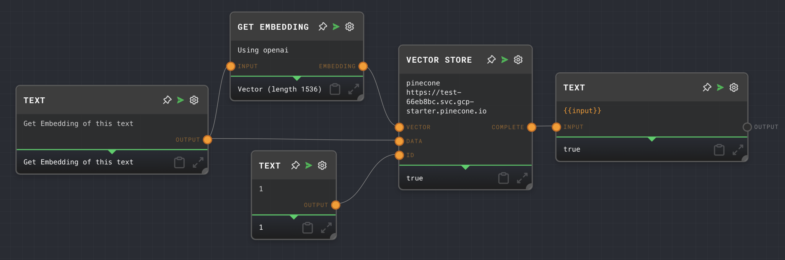

# Vector Store Node

import Tabs from '@theme/Tabs';
import TabItem from '@theme/TabItem';

## Overview

The Vector Store Node takes a vector embedding and stores it in a vector store. The vector store can then be used to perform similarity searches.

The Vector Store Node is used to store vectors in a vector database. It takes in a vector and data to store with the vector. This data is stored in the configured vector database integration for later retrieval.

The Vector Store Node is part of the Input/Output group of nodes.

<Tabs
  defaultValue="inputs"
  values={[
    {label: 'Inputs', value: 'inputs'},
    {label: 'Outputs', value: 'outputs'},
    {label: 'Editor Settings', value: 'settings'},
  ]
}>

<TabItem value="inputs">

## Inputs

| Title         | Data Type | Description                                                                                   | Default Value | Notes                                                                                                 |
| ------------- | --------- | --------------------------------------------------------------------------------------------- | ------------- | ----------------------------------------------------------------------------------------------------- |
| Vector        | `vector`  | The vector to be stored.                                                                      | (required)    |                                                                                                       |
| Data          | `any`     | The data to be stored with the vector.                                                        | (required)    |                                                                                                       |
| ID            | `string`  | The ID to be used for the vector. If not provided, a unique ID will be generated automatically. | (optional)    |                                                                                                       |
| Integration   | `string`  | The name of the vector database integration to use.                                            | (optional)    | Only required if `Use Integration Input` is enabled in the Editor Settings.                           |
| Collection ID | `string`  | The ID of the collection in the vector database where the vector will be stored.               | (optional)    | Only required if `Use Collection ID Input` is enabled in the Editor Settings.                          |

</TabItem>

<TabItem value="outputs">

## Outputs

| Title    | Data Type | Description                                                                                   | Notes                                                                                                 |
| -------- | --------- | --------------------------------------------------------------------------------------------- | ----------------------------------------------------------------------------------------------------- |
| Complete | `boolean` | Indicates whether the vector has been successfully stored. Returns `true` if storage is successful. |                                                                                                       |

</TabItem>

<TabItem value="settings">

## Editor Settings

| Setting                  | Description                                                                                   | Default Value | Use Input Toggle | Input Data Type |
| ------------------------ | --------------------------------------------------------------------------------------------- | ------------- | ---------------- | --------------- |
| Integration              | The name of the vector database integration to use.                                           | `pinecone`    | Yes              | `string`        |
| Collection ID            | The ID of the collection in the vector database where the vector will be stored.              | (empty)       | Yes              | `string`        |

</TabItem>

</Tabs>

## Example 1: Storing a vector in a vector database

1. Create a Vector Store Node. Set the `Integration` to the name of your vector database integration and the `Collection ID` to the ID of the collection where you want to store the vector.
2. Create a [Text Node](./text.mdx) or any other node that outputs data and connect a [Get Embedding Node](./get-embedding) to create a vector of the data.
3. Connect the `Embedding` output of the Get Embedding Node to the `Vector` input of the Vector Store Node.
4. Connect the `Output` of the Text Node to the `Data` input of the Vector Store Node.
3. Create a [Text Node](./text.mdx) and update it's text to a unique ID for the vector. Connect the `Output` of the Text Node to the `ID` input of the Vector Store Node.
4. Run the graph. The `Complete` output of the Vector Store Node should return `true`, indicating that the vector has been successfully stored.

## Error Handling

If the Vector Store Node encounters an error while trying to store the vector, it will throw an error and stop the graph's execution. Common reasons for errors include:

- The vector database integration is not available or not correctly configured.
- The collection ID does not exist in the vector database.
- The vector or data inputs are not correctly formatted.

## FAQ

**Q: Can I use the Vector Store Node to store vectors in any vector database?**

A: The Vector Store Node can be used to store vectors in any vector database that is supported by Rivet and has been correctly configured in the host application.

**Q: Can I store multiple vectors at once?**

A: No, the Vector Store Node can only store one vector at a time. If you need to store multiple vectors, you can use a loop or map operation to store each vector individually.

**Q: Can I update a vector that has already been stored?**

A: Yes, you can update a stored vector by storing a new vector with the same ID. The new vector will replace the existing vector in the vector database.

## See Also

- [Pinecone](../user-guide/plugins/built-in/pinecone.md)