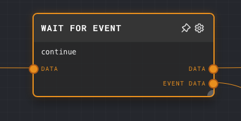
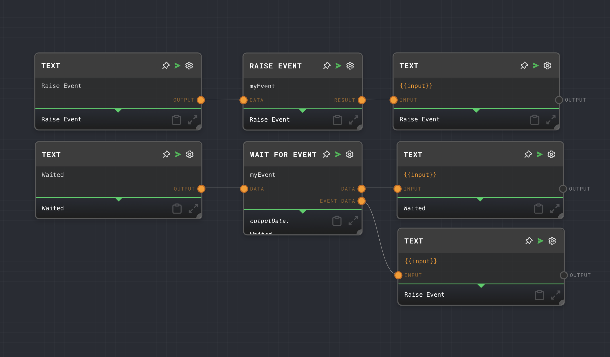

import Tabs from '@theme/Tabs';
import TabItem from '@theme/TabItem';

## Overview

The Wait For Event Node is used to pause the execution of a graph until a specific event is raised by a [Raise Event Node](./raise-event.mdx) or the host project. The event name can be configured in the node settings or provided dynamically via an input port.

This node is useful in scenarios where you want to wait for an external event to occur before proceeding with the graph execution. For example, you might want to wait for a user to click a button, or for an API call to complete.

<Tabs
  defaultValue="inputs"
  values={[
    {label: 'Inputs', value: 'inputs'},
    {label: 'Outputs', value: 'outputs'},
    {label: 'Editor Settings', value: 'settings'},
  ]
}>

<TabItem value="inputs">

## Inputs

| Title      | Data Type | Description                                                                 | Default Value | Notes                                                                 |
| ---------- | --------- | --------------------------------------------------------------------------- | ------------- | --------------------------------------------------------------------- |
| Data       | `any`     | Any data to be passed through the node.                                     | N/A           | This data will be outputted from the `Data` output port.              |

</TabItem>

<TabItem value="outputs">

## Outputs

| Title     | Data Type | Description                                                                 | Notes                                                                 |
| --------- | --------- | --------------------------------------------------------------------------- | --------------------------------------------------------------------- |
| Data      | `any`     | The data passed in through the `Data` input port.                           | If no data is passed into the `Data` input port, this port will not run. |
| Event Data| `any`     | The data associated with the event that was raised.                         | If the event has no associated data, this port will not run.          |

</TabItem>

<TabItem value="settings">

## Editor Settings

| Setting          | Description                                                                                                                         | Default Value  | Use Input Toggle | Input Data Type |
| ---------------- | ----------------------------------------------------------------------------------------------------------------------------------- | -------------- | ---------------- | --------------- |
| Event Name       | The name of the event to wait for. Must match the name of the event raised by the Raise Event Node or the host project.             | `continue`     | Yes              | `string`        |

</TabItem>

</Tabs>

## Example 1: Wait for an event raised by a Raise Event Node

1. Create a [Raise Event Node](./raise-event.mdx) and set the `Event Name` to `myEvent`.
2. Create a Wait For Event Node and set the `Event Name` to `myEvent`.
3. Connect a text node to the Data input port of the Raise Event Node with the text as `Raise Event`.
4. Connect a text node to the Data input port of the Wait For Event Node with the text as `Waited`.
5. Connect the output ports of the Raise Event Node and Wait For Event Node to the input ports of text nodes.
6. Run the graph. The Wait For Event Node will wait until the Raise Event Node raises the `myEvent` event.
7. Notice how the Wait For Event Node outputs the data from the Raise Event Node from the `Event Data` output port.

## Error Handling

The Wait For Event Node cannot error under normal circumstances. If the event is not raised, the node will wait indefinitely.

## FAQ

**Q: Can I use the Wait For Event Node to wait for multiple events?**

A: No, the Wait For Event Node can only wait for a single event. If you want to wait for multiple events, you can use multiple Wait For Event Nodes.

**Q: Can I use the Wait For Event Node to wait for an event raised by an API call?**

A: Yes, you can use the [HTTP Call Node](./http-call.mdx) to make an API call, and then use the Wait For Event Node to wait for an event raised by the API call.

## See Also

- [Raise Event Node](./raise-event.mdx)
- [HTTP Call Node](./http-call.mdx)
- [External Call Node](./external-call.mdx)
- [Code Node](./code.mdx)