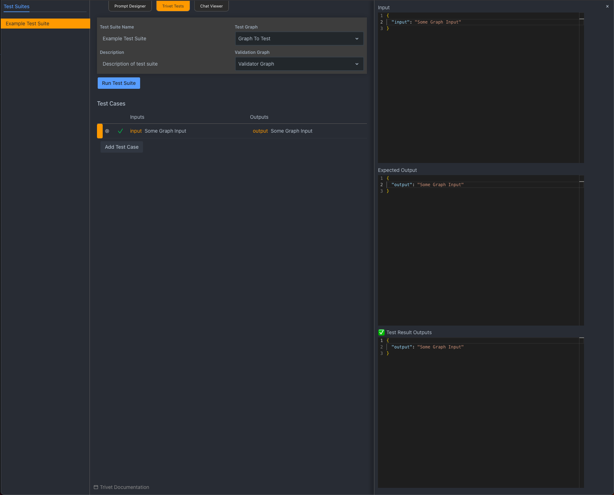

# Trivet

Trivet is a library for running Rivet tests, and an integrated test runner in the Rivet application.

For getting started with Trivet Tests, see the [Trivet - Getting Started](user-guide/trivet-getting-started) guide.

If you are interested in the Trivet library for running Trivet tests programatically, such as in CI, see the [Trivet Library](user-guide/trivet-library) guide.

See the [Trivet Tutorial](user-guide/trivet-tutorial) for a step-by-step guide on using Trivet for the first time.

