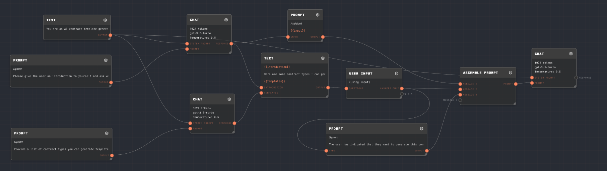
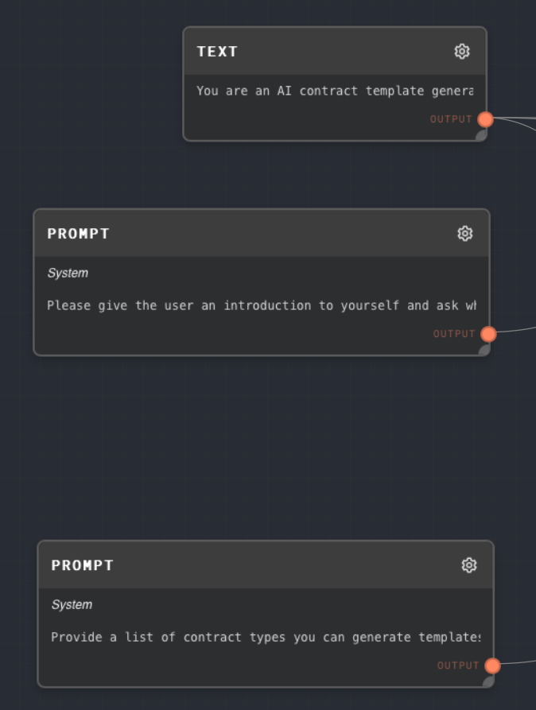
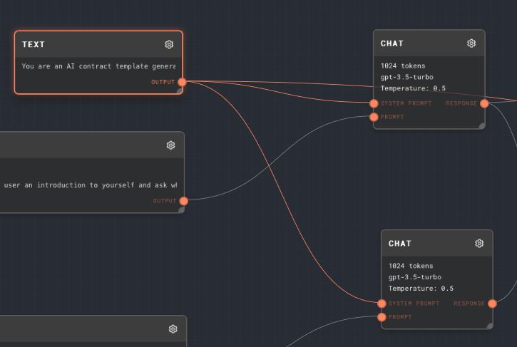
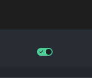
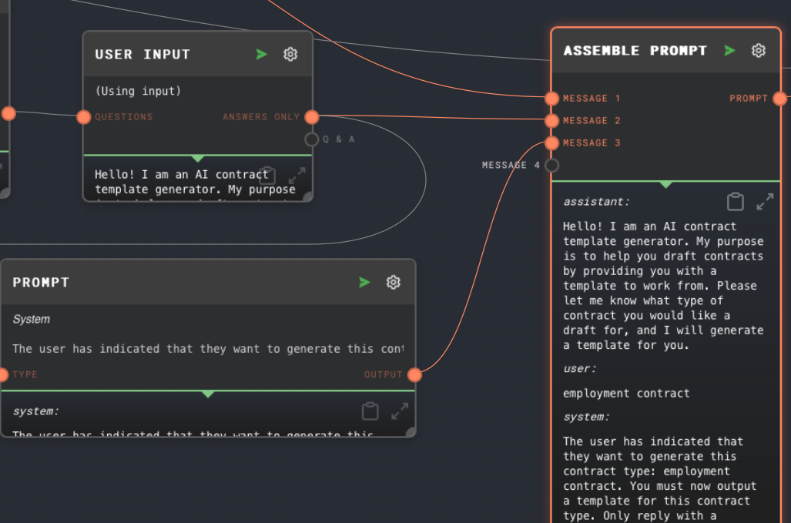
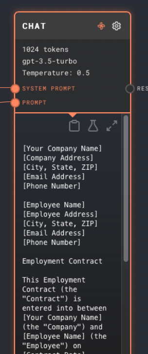

# Interpolation & More Node Types

In the sidebar you should see the graphs tab with a list of numbered folders with graphs. These are the graphs that are included in the tutorial project.

Inside the `2. Interpolation` folder you should see an `Interpolation` graph. Click on the graph to open it.

You should see the following graph:

Try running this graph by clicking the `Run` button. You will see the two [Chat Nodes](../node-reference/chat.mdx) run in parallel. Then, you will get a user input prompt that looks something like this:

Try entering the name of one of the contracts in the list and submitting. You should then see the final [Chat Node](../node-reference/chat.mdx) start to run. Once it is complete, it should give you a template for that contract type you have chosen!

Let's go over this graph piece by piece:

## Setup

First, we have one [Text Node](../node-reference/text.mdx) as a system prompt, and two [Prompt Nodes](../node-reference/prompt.mdx) to prompt GPT to generate text:

The system prompt text is:

> You are an AI contract template generator. Given a type of contract from the user, you will output a template that the user can then use to draft a contract using your template.

The first prompt is:

> Please give the user an introduction to yourself and ask what contract they would like a draft for.

The second prompt is:

> Provide a list of contract types you can generate templates for. A maximum of 10. Reply with only a list of contract types.

The system prompt is connected to the `System Prompt` port of all the [Chat Nodes](../node-reference/chat.mdx) in the graph. The first prompt is connected to the `Prompt` port of the first chat node, and the second prompt is connected to the `Prompt` port of the second chat node.

## Initial Prompts and Combining Outputs

After each of the chats has (in parallel) generated its output (the first being an introduction, and asking the user what contract to generate, and the 2nd being a list of contracts it can generate), the two outputs are fed into a [Text Node](../node-reference/text.mdx) that combines the two outputs into one string:

> {{introduction}}
>
> Here are some contract types I can generate templates for:
>
> {{templates}}

The text inside {{curly_braces}} is marked as a replacement for one of the input ports of the text node. The inputs to the text node are dynamic based on the text prompt inside the text node. In this case, we get two inputs, `introduction` and `templates`, corresponding to the two {{curly_braces}} in the text prompt and the two previous chat nodes.

## User Input

Using the toggle at the bottom of the settings of the [User Input Node](../node-reference/user-input.mdx), we can set the user input's question to be dynamic! So, we pass the merged text into user input node's question port to ask the combined question for the user

## Additional System Prompt

The next thing we do is combine all these messages together using an [Assemble Prompt Node](../node-reference/assemble-prompt.mdx), and additionally append one more system prompt instructing the AI what to do next:

The prompt is a [Prompt Node](../node-reference/prompt.mdx) set to type System with the following text:

> The user has indicated that they want to generate this contract type: {{type}}. You must now output a template for this contract type. Only reply with a template.

We pass the text the user entered for the user input node into the `type` port of the system prompt.

## Final Response

Finally, we pass this list of messages into a final [Chat Node](../node-reference/chat.mdx) to generate the final response, which should be a contract template!

