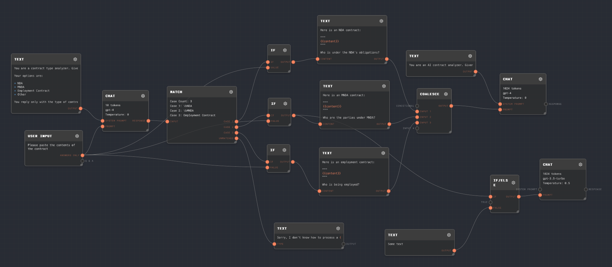

# Matching & Conditionals

In the sidebar you should see the graphs tab with a list of numbered folders with graphs. These are the graphs that are included in the tutorial project.

Inside the `3. Matching and Conditionals` folder you should see an `Matching and Conditionals` graph. Click on the graph to open it.

You should see the following graph:

We can use this example NDA generated from the previous tutorial!

> Non-Disclosure Agreement
>
> This Non-Disclosure Agreement (the "Agreement") is entered into between [Disclosing Party], located at 111 St, and Receiver, Inc, located at 222 St, collectively referred to as the "Parties".
>
> Purpose The Parties desire to explore a potential business relationship (the "Purpose") and, in connection with this Purpose, may need to disclose certain confidential information to each other.
>
> Definition of Confidential Information Confidential Information refers to any information, data, or materials, in any form, whether oral, written, or electronic, that is disclosed by one Party (the "Disclosing Party") to the other Party (the "Receiving Party") and is marked as "confidential" or reasonably understood to be confidential based on its nature.
>
> Obligations of the Receiving Party The Receiving Party agrees to: a. Maintain the confidentiality of the Disclosing Party's Confidential Information with the same degree of care it uses to protect its own confidential information, but not less than a reasonable standard of care. b. Use the Confidential Information solely for the Purpose and not for any other purpose without the prior written consent of the Disclosing Party. c. Not disclose the Confidential Information to any third party without the prior written consent of the Disclosing Party, except as required by law or as necessary for the Purpose, provided that the Receiving Party ensures that any recipients are bound by confidentiality obligations at least as restrictive as those set forth in this Agreement. d. Promptly notify the Disclosing Party of any unauthorized disclosure or use of the Confidential Information and assist in any actions to prevent or stop such unauthorized disclosure or use.
>
> Term and Termination This Agreement shall be effective as of the date of signing and shall continue until Jan 2025. Either Party may terminate this Agreement upon written notice to the other Party. The obligations of confidentiality shall survive the termination of this Agreement.
>
> Remedies The Parties acknowledge that any unauthorized use or disclosure of the Confidential Information may cause irreparable harm to the Disclosing Party, for which monetary damages may not be an adequate remedy. In such cases, the Disclosing Party shall be entitled to seek injunctive relief or any other appropriate equitable remedies.
>
> Governing Law and Jurisdiction This Agreement shall be governed by and construed in accordance with the laws of New England. Any disputes arising out of or in connection with this Agreement shall be subject to the exclusive jurisdiction of the courts of New England.
>
> Entire Agreement This Agreement constitutes the entire understanding between the Parties concerning the subject matter hereof and supersedes all prior agreements, understandings, and communications, whether oral or written, between the Parties relating to the Confidential Information.
>
> IN WITNESS WHEREOF, the Parties have executed this Non-Disclosure Agreement as of the date first written above.
>
> Discloser, Inc
>
> Name: Mr. Discloser
>
> Title: CEO
>
> Receiver, Inc
>
> Name: Mr. Receiver
>
> Title: CEO
