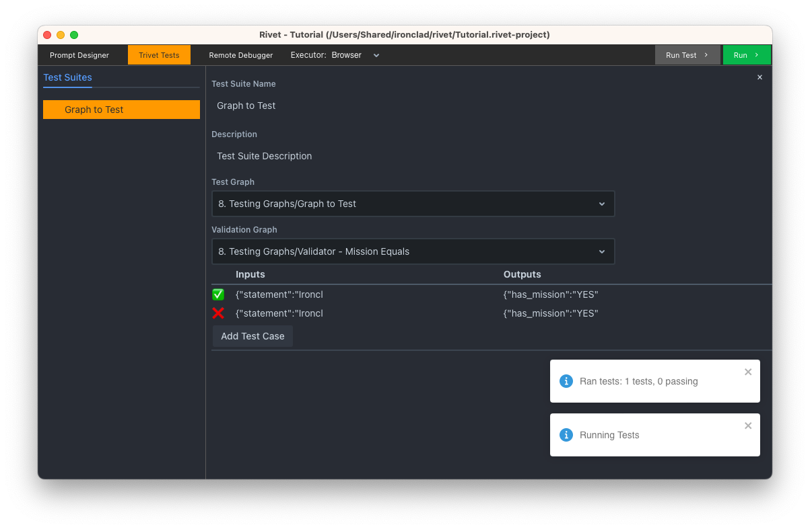

# Testing Graphs

As your graphs get more complicated, it becomes important to test whether they improving without regressing previous functionality.

Click on the "Trivet Tests" button in the top menu, and click on "Graph to Test" in the "Test Suites" panel. Now, click "Run Test" in the top right. Once the test cases run, you should see something like this:

What just happened?

- We tested the graph `8. Testing Graphs/Graph to Test`, which takes an input (`statement`) and two outputs (`has_mission` and `mission_statement`).
- We ran the test graph on two "test cases," each of which has a test input (an object with a `statement` property) and an expected output (an object with `has_mission` and `mission_statement` properties).
- We ran the output of the test graph through a "validator graph," which takes the `input`, `expected_output`, and (actual) `output`, and outputs true/false for whether the test is passing (either as a string or boolean).

If you click on the test cases, you can see what the latest actual output was. This can be helpful for seeing what went wrong. For example, in the screenshot below, we can see that `has_mission` was expected to be "YES" or "NO," but the result was much more verbose.

## Experiments

- Try fixing any failing tests, by updating `8. Testing Graphs/Graph to Test` so that they pass.
- Add another Test Case with a different statement and expected outputs.
- Add another Test Suite and validation graph for testing the `mission_statement` property.
