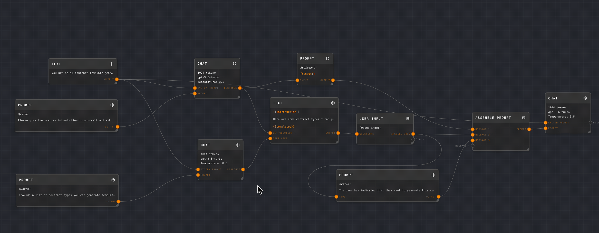

## Adding Nodes

To add a node to the current graph, right click in the empty space on the graph (or press space!), and enter the Add menu.

You can search for a node by starting to type after the menu is open.

Nodes are grouped by their category. Selecting a node will add it to the graph where you right clicked.

See the [Node Reference](../node-reference) for more information about all possible nodes that can be added.

## Moving Nodes

Click and drag on the title bar of a node to move it on the node canvas. You can also select multiple nodes by holding shift and clicking on the title bars of multiple nodes. You can then move all of the selected nodes as a group.

## Deleting Nodes

Right click on a node and select **Delete** to delete it. **Warning: There is no undo at this time!**

## Connecting Nodes

Nodes are connected by clicking and dragging from a port on one node to a port on another node. Ports are the connection points on the node. Ports can be inputs or outputs. Inputs are on the left side of the node and outputs are on the right side of the node.

The output port of a node can connect to multiple input ports on other nodes.

The input port of a node can only connect to one output port on another node.

The data type of every port is available in the documentation for each node in the [Node Reference](../node-reference).

## Disconnecting Nodes

Click and drag on a connected port to move the connection to a different port, or click and drag to an empty space for an existing connection to delete the connection.

## Creating a Subgraph

To create a subgraph, select multiple nodes by holding shift and clicking on the title bars of multiple nodes. Then right click on one of the selected nodes and select **Create Subgraph**. This will create a new (_unsaved!_) graph containing the nodes you selected, as well as additional input and output nodes to connect the subgraph to the parent graph.

Make sure you go into the graph info section for the subgraph and give it a name and description, or else it will be Untitled Graph.

Make sure you save your new graph! (CMD+S or CTRL+S)

The source nodes will **not** be removed from the parent graph at this time. It is up to you to replace them with your newly created subgraph.

## Editing a Node

Click the gear icon on the top right of a node to edit it. This will open the Node Editor. See the [interface overview](./overview-of-interface) for more information about the Node Editor.
