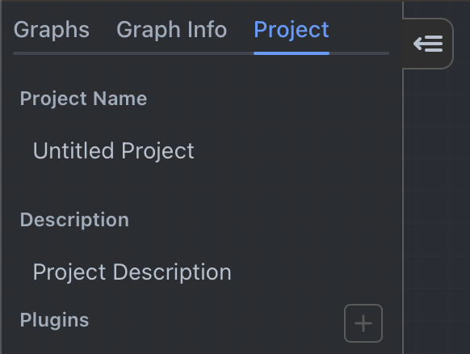
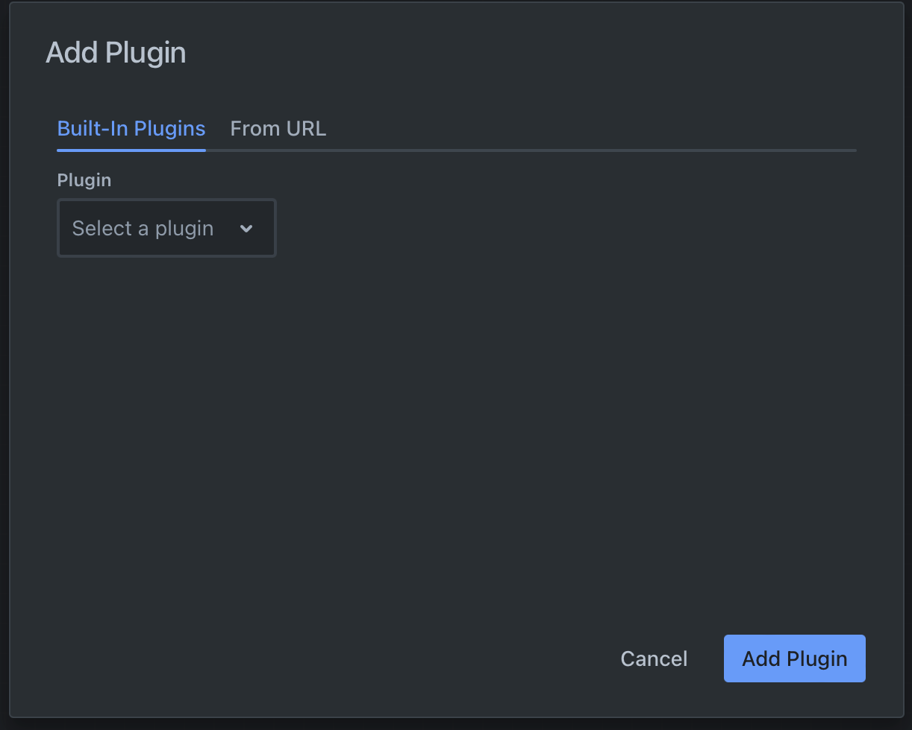

# Plugins

Plugins allow authors to extend the functionality of Rivet, such as adding new nodes that
you can use in your graphs.

## Enabling Plugins

To enable a built-in plugin, go to the **Project** tab on the left panel. You will see a **Plugins** section there. Click
the **+** button to add a plugin to the project.

The modal the pops up will allow you to either enable one of the built-in plugins, or enter a URL to
load a remote plugin.

## Built-in Plugins

A project can enable any number of the built-in plugins in Rivet. See the [Built-In Plugins List](/docs/user-guide/plugins/built-in/all) page for a list of all the built-in plugins and their documentation.

## Remote Plugins

Documentation to be written.
