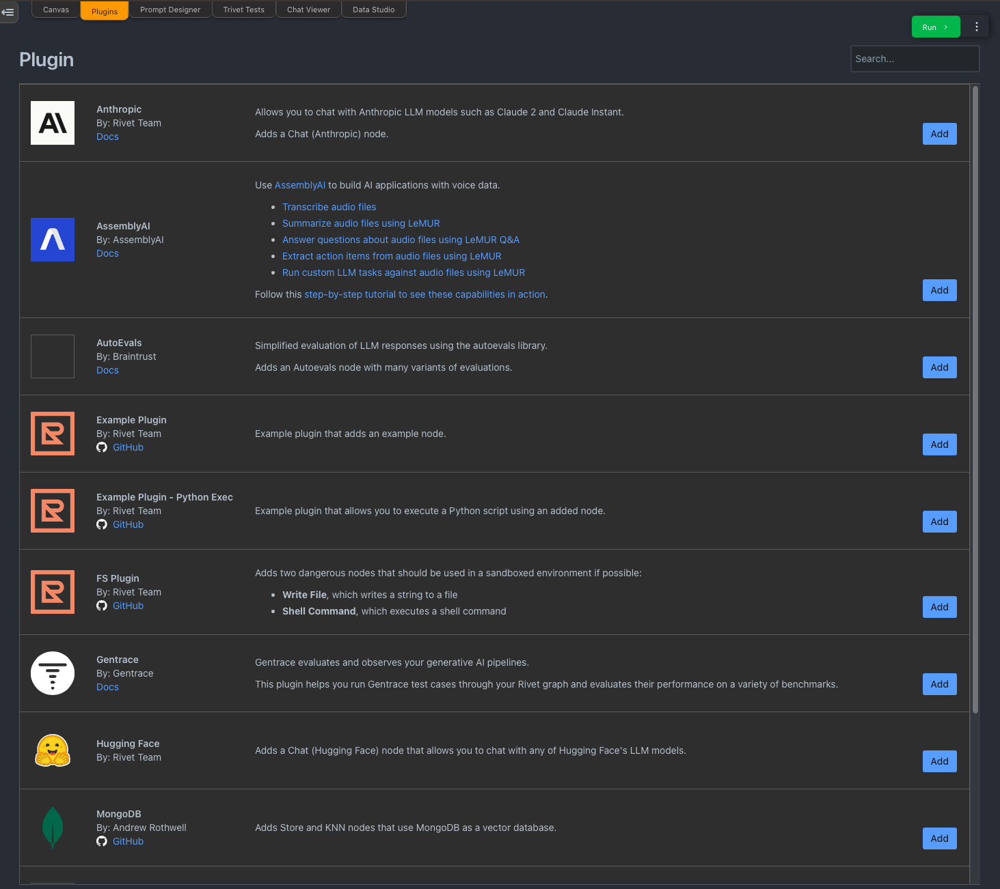
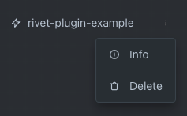
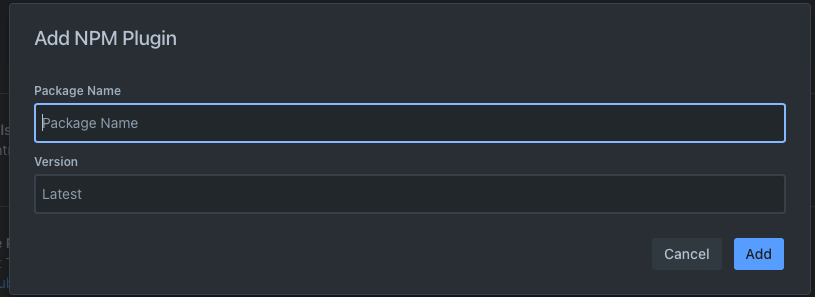

# Plugins

Plugins allow authors to extend the functionality of Rivet, such as adding new nodes that you can use in your graphs.

## Enabling Plugins

Plugins are configured per-project, and the plugins enabled for a project will be remembered when opening a project.

To enable a plugin, go to the **Plugins** tab at the top of the screen. You will see all plugins that are available to install on the plugins screen.

Click the Add buttton next to any plugin to install it to your current project.

## Removing Plugins

To remove a plugin, navigate to the **Project** tab in the left sidebar, and find your plugin in the plugins list. Click the `...` menu next to the plugin and select **Remove**.

## Installing Custom Plugins

If the plugin you want to install is not part of the plugins shown in Rivet, you can install any Rivet plugin using the `NPM Plugin` option at the bottom of the plugins list.

The plugin you are installing must be published on NPM. Click the Add button, and in the modal, enter the name of the plugin (and optionally the version) you want to install.

## Installing Plugins from Source

You can install plugins from their source code by following the steps here:

1. In a terminal, navigate to plugin install directory for your operating system. The plugin install directory is shown below the plugins list in Rivet, with a copy button.
2. Make a directory for the plugin. It must be named `<package-name>-latest`, where `<package-name>` is the name of the plugin package.
3. Inside the directory you have created, run `git clone <git-url> package` to clone the plugin source code into the `package` directory.
4. In Rivet, choose Add NPM Plugin at the bottom of the plugins list. Enter `<package-name>` for the package name. It must match exactly to the package name you used above, and the `name` field of the package.json must also match this name.
5. If the plugin does not commit its bundled files, you may need to run `yarn` and `yarn build` inside the `package` directory to build the plugin. Ideally plugins will commit their bundled files so that you do not need to build them yourself.
6. Click Add to install the plugin. It will now be available in your project.
