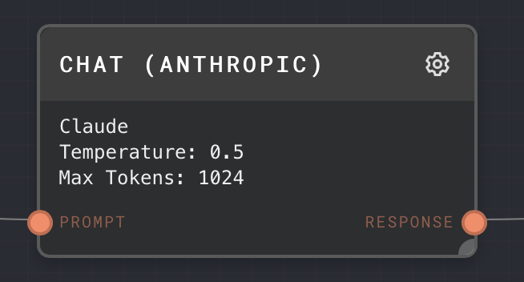

# Anthropic Plugin

The Anthropic plugin provides access to [Claude and Claude Instant](https://www.anthropic.com/product) using the
**Chat Anthropic** node.

:::info

At the moment you must use the [node executor](../../executors.md) to use the Anthropic plugin in the Rivet UI. You may also use the plugin when embedding Rivet in your own application.

:::

## Configuration

You must put your Anthropic API key in the Rivet settings panel once the Anthropic plugin has been enabled. See [Settings](../../../getting-started/setup.md) for more information.

## Nodes

### Chat (Anthropic) Node

The Chat (Anthropic) node allows you to use the Claude API to generate text.

#### Inputs

| Title  | Data Type                                                    | Description                                                                                                              | Default Value | Notes                                                                                                                                                                                                                                                                                                                 |
| ------ | ------------------------------------------------------------ | ------------------------------------------------------------------------------------------------------------------------ | ------------- | --------------------------------------------------------------------------------------------------------------------------------------------------------------------------------------------------------------------------------------------------------------------------------------------------------------------- |
| Prompt | `string` or `string[]` or `chat-message` or `chat-message[]` | The messages to send to Claude to get a response.                                                                        | (Required)    | Claude Instant and Claude 2.0 does not support a system prompt like GPT does, so you may have to get inventive to place words into Claude's mouth using Prompt nodes set to `AI`.                                                                                                                                     |
| System | `string`                                                     | A system prompt to provide context and instructions to Claude. This input is only available when using a Claude 3 model. | (Optional)    | Use the system prompt to specify a particular goal or role for Claude. You can instead include a `system`-type `chat-message` in the Prompt input. If there are multiple `system`-type messages, only the first one will be used. See the [guide to system prompts](https://docs.anthropic.com) for more information. |

#### Outputs

| Title    | Data Type | Description                      | Notes |
| -------- | --------- | -------------------------------- | ----- |
| Response | `string`  | The response message from Claude |       |

#### Editor Settings

| Setting     | Description                                                                                                            | Default Value | Use Input Toggle | Input Data Type |
| ----------- | ---------------------------------------------------------------------------------------------------------------------- | ------------- | ---------------- | --------------- |
| Model       | The Claude model to use for the request (Claude 3 Opus, Claude 3 Sonnet, Claude 2.1, Claude 2 or Claude Instant)       | Claude 2      | Yes              | `string`        |
| Temperature | The sampling temperature to use. Lower values are more deterministic. Higher values are more "creative".               | 0.5           | Yes              | `number`        |
| Top P       | Alternate sampling mode using the top X% of values. 0.1 corresponds to the top 10%.                                    | 1             | Yes              | `number`        |
| Use Top P   | Whether to use the Top P sampling mode.                                                                                | false         | Yes              | `boolean`       |
| Max Tokens  | The maximum number of tokens that GPT is allowed to return. When hitting the max tokens, the response will be cut off. | 1024          | Yes              | `number`        |
| Stop        | Comma separated list of stop tokens. If any stop token is encountered, the response will end immediately.              | (None)        | Yes              | `string[]`      |

#### Using Vision with Claude 3 Models

When using a Claude 3 model (Claude 3 Opus or Claude 3 Sonnet), you can use the [Assemble Message Node](../../../node-reference/assemble-message.mdx) to create prompt messages that contain an image.
