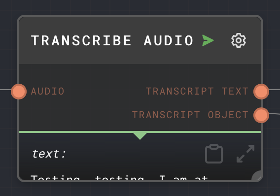
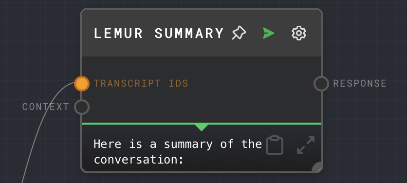
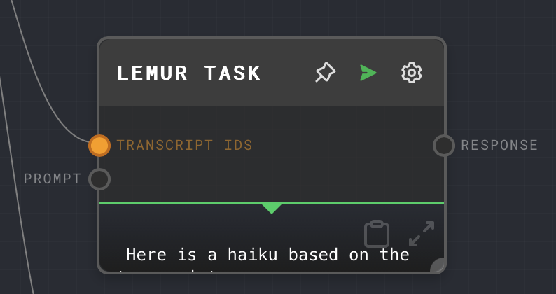
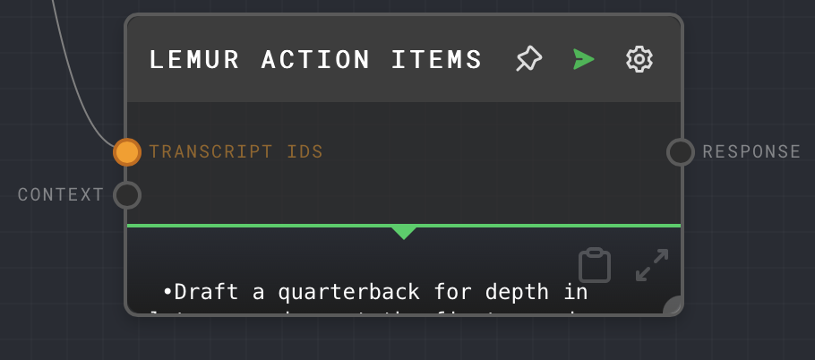

# AssemblyAI Plugin

:::info

At the moment you must use the [node executor](../../executors.md) to use the AssemblyAI plugin in the Rivet UI. You may also use the plugin when embedding Rivet in your own application.

:::

## Nodes

### Transcribe Audio Node

The Transcribe Audio node transcribes audio using the [AssemblyAI](https://www.assemblyai.com/) API. It will return a transcript of the given audio source.

### LeMUR Nodes

AssemblyAI's LeMUR (Leveraging Large Language Models to Understand Recognized Speech) is a framework to process audio files with an LLM.
The AssemblyAI plugin has a dedicated node for each LeMUR endpoint. 
Each node accepts Transcript IDs as input which you can get from the Transcribe Audio Node. Additional parameters are available as inputs and as node configuration. For more information what these parameters do, [check out the LeMUR API reference](https://www.assemblyai.com/docs/api-reference/lemur).

#### LeMUR Summary Node

The LeMUR Summary node uses LeMUR to summarize a given transcript.

#### LeMUR Q&A Node

Given a transcript and questions, LeMUR can generate answers.

#### LeMUR Custom Task Node

Given a transcript and prompt, LeMUR can will generate a response from the prompt and transcript.

#### LeMUR Action Items Node

Given a transcript of a meeting, the LeMUR Action Items node will return a list of action items from the meeting.

