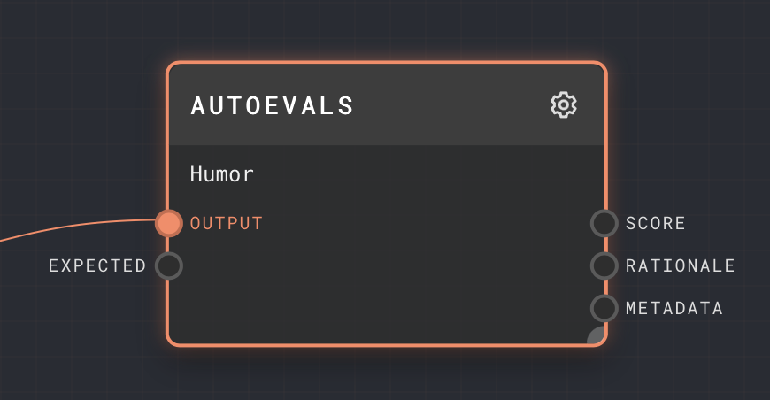

# Autoevals Plugin

The Autoevals plugin provides a node that can automatically evaluate the performance of an LLM response using a battle-tested set of prompts.

For more information on autoevals, see [its documentation](https://github.com/braintrustdata/autoevals).

## Nodes

### Autoevals Node

#### Inputs

The inputs to the Autoevals node depend on the configured evaluation being performed. All types will have an
`output` port - This is the LLM response that will be evaluated. For other ports, see the table below.

#### Outputs

| Title     | Data Type | Description                                                                                                                                      | Notes |
| --------- | --------- | ------------------------------------------------------------------------------------------------------------------------------------------------ | ----- |
| Score     | `number`  | The score that has been given to the response, from 0 to 1. A 0 indicates complete failure, and a 1 indicates a complete pass.                   |       |
| Rationale | `string`  | The rationale for the score that has been given to the response.                                                                                 |       |
| Metadata  | `object`  | The complete metadata associated with the autoevals evaluation, including the rationale and any other information specific to the type selected. |

#### Editor Settings

| Setting   | Description                                         | Default Value | Use Input Toggle | Input Data Type |
| --------- | --------------------------------------------------- | ------------- | ---------------- | --------------- |
| Evaluator | The evaluation that will be performed on the input. | Factuality    | No               | N/A             |

## Evaluations

See the [autoevals documentation](https://github.com/braintrustdata/autoevals)
