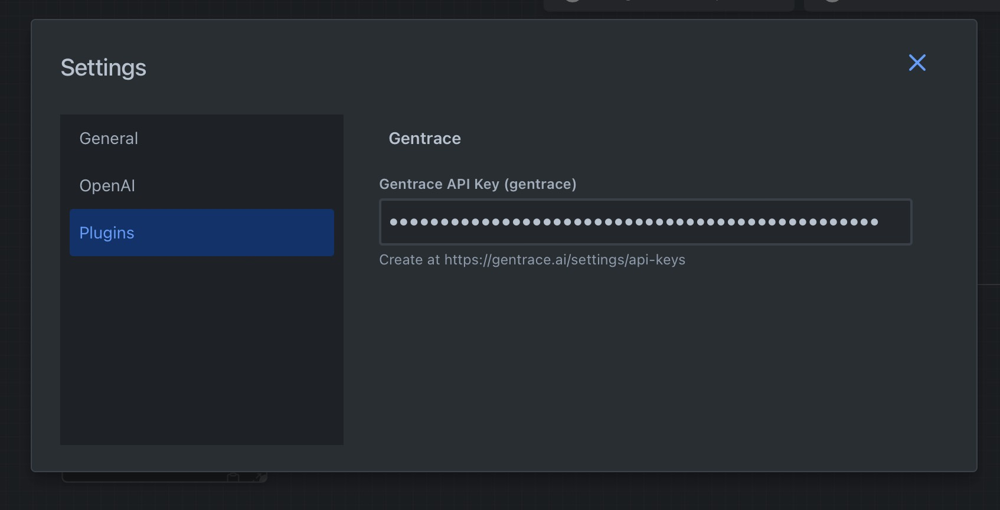
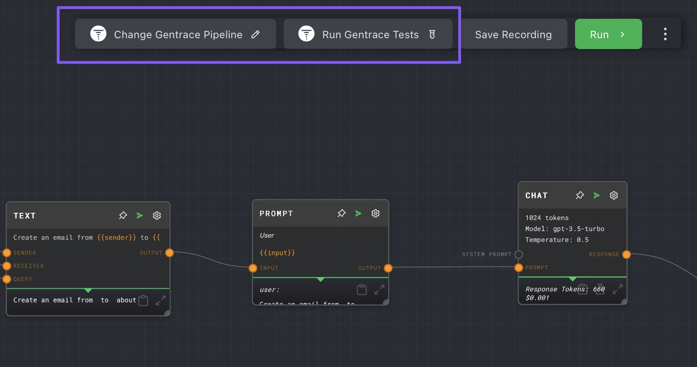
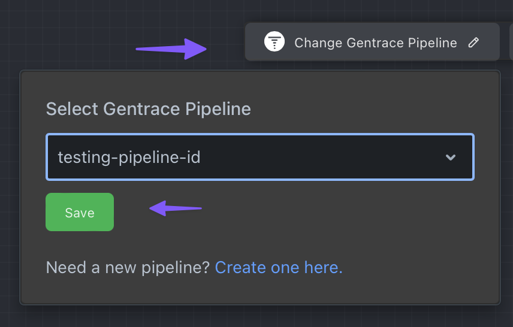
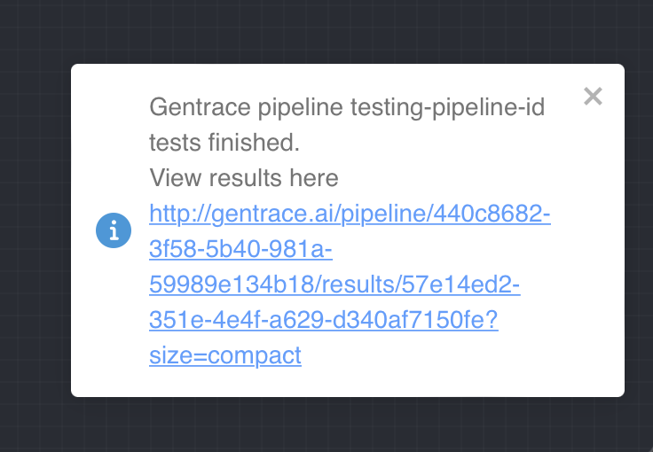

# Gentrace Plugin

[Gentrace](https://gentrace.ai) is an evaluation and observability product that helps improve the quality, safety, and compliance of your AI features.

Gentrace complements Rivet by providing Rivet users a seamless way to evaluate their Rivet graphs using Gentrace.

This plugin adds UI to interact with Gentrace directly from the Rivet graph.

### Documentation

Gentrace's documentation is publicly available [here](https://docs.gentrace.ai/docs).

### Getting started

Once the Gentrace plugin is installed in Rivet, you will need to [create a Gentrace API key](https://gentrace.ai/settings/api-keys) if you don't already have one.

Then, supply that API key in the Gentrace plugin tab.



### Usage

The plugin exposes two buttons in the Rivet graph view that show up next to the "Run" button.



#### Associating a Gentrace pipeline

The "Change Gentrace Pipeline" button associates a Gentrace pipeline with a Rivet graph. 



A Gentrace pipeline captures the analytics, test cases, evaluators, and evaluation results for a generative workflow. Learn more about [Gentrace pipelines here](https://docs.gentrace.ai/docs/pipelines).

#### Running Gentrace tests

The "Run Gentrace tests" button pulls and runs [test cases](https://docs.gentrace.ai/docs/test-cases) defined in the associated Gentrace pipeline through the Rivet graph. 

To make this more concrete, let's say you define 100 example test cases for a Gentrace pipeline. Each test case has the following schema.

```typescript
type EmailTestCase = {
  "query": string;
  "sender": string;
  "receiver": string;
};
```

The plugin will pull all test cases and invoke the Rivet graph once per case. During each invocation, each key-value pair from a test case maps onto a Graph Input Rivet node with a matching ID. 

With the TestCase schema above, three Graph Input Rivet nodes are required to properly run the graph.


### Viewing test results

Once the Gentrace plugin finishes running all test cases through the Rivet graph, the plugin will show a toast notification with a link to the results.

The linked report shows how well that Rivet graph performs against the evaluation benchmarks provided in Gentrace.



### Understanding Gentrace evaluation

To learn more about your Gentrace evaluation results, read through the Gentrace evaluation [core concepts](https://docs.gentrace.ai/docs/evaluate-overview) and [quickstart](https://docs.gentrace.ai/docs/evaluate-quickstart) pages.

### Contact

Reach out to [support@gentrace.ai](mailto:support@gentrace.ai) if you have any questions or feature requests.
