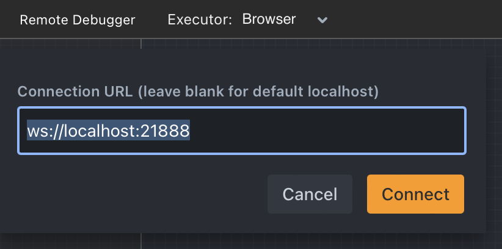

Remote debugging allows you to integrate the Rivet Core or Rivet Node libraries in another application, run your graphs in that other application, but see the live graph execution in the Rivet application! This is useful for debugging graphs that are running in a production environment, or for debugging graphs that are running in a different environment than the Rivet application. This is very useful when using the [External Call Node](../node-reference/external-call), as the default executor cannot call into your own application's code.

## Connecting the Remote Debugger

Select the **Remote Debugger** menu option in the Action Bar's menu dropdown, or press the **F5** key to open the remote debugger dialog. You must enter a WebSocket URI here to connect to. This URI must be a WebSocket server that uses `startRivetDebuggerServer`. This is a function exported by the Rivet Core and Rivet Node libraries. You can use this function to start a WebSocket server that will allow the Rivet application to connect to it.

By default, `startRivetDebuggerServer` will listen for all WebSocket connections on port **21888**. You can change this by passing a port number to the options argument to `startRivetDebuggerServer`.

## Running a Graph

If the debugger server has configured `dynamicGraphRun`, then when clicking the **Run** button in Rivet, the currently viewed graph will be executed on the remote server. If `allowGraphUpload` is enabled, then the graph will be uploaded to the remote server before being executed, allowing you to make changes to the current graph and run them without saving or uploading your project file to the remote server.

## Using the Remote Debugger

Whenever a graph is started on the server, its execution will immediately be visible in Rivet if it is connected as a remote debugger.

By default, you can both pause and abort the current execution in Rivet, and the execution will be paused or aborted on the remote server. This can be useful if you want to pause the execution to inspect the current state of the graph, or if you want to abort the execution because you detect some incorrect behavior.

## Supporting Remote Debugging

See the [remote debugging](../api-reference/remote-debugging) section of the API Reference for more information on how to support remote debugging in your application.
