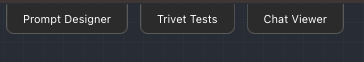
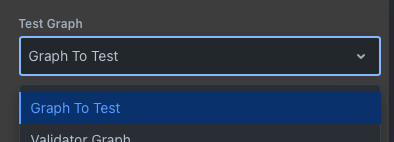
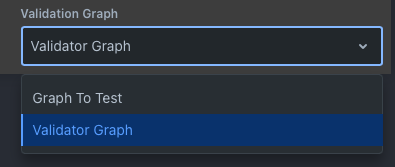
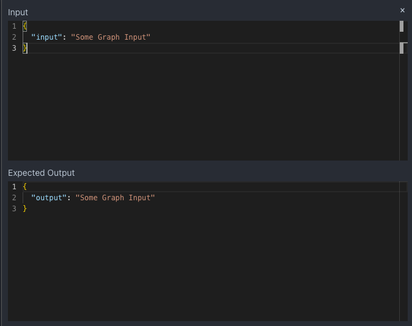

# Trivet - Getting Started

To get started with Trivet, select the `Trivet Tests` tab at the top of the Rivet application.

## Test Suites

Initially, you will have no test suites. Trivet is organized into test suites - each test suite has a single graph to test, and a single validator graph.

To add a new Test Suite, click the New Test Suite button if you have none, or right click and choose `New Test Suite` in the test suite list on the left.

### Test Graph

The test graph is the graph that you want to test. It can have any [Graph Input](../node-reference/graph-input) nodes, and any [Graph Output](../node-reference/graph-output) nodes. Trivet will pass in various inputs to the graph, and compare the outputs to the expected outputs using the Validator Graph.

Select the test graph using the dropdown at the top:

Each test case is required to pass every input to the graph. You may find it useful to create a separate "test" graph for your actual target test graph. This will let you pass in any default values for the inputs, and will let you add any additional nodes that you need to test your graph and extract the outputs from the graph that you care about.

### Validator Graph

Instead of using baked-in validations, Trivet uses Rivet graphs to perform validation on your test graph. This allows you the ultimate flexibility in how you want to validate your graph. Select the validator graph using the dropdown at the top:

A validator graph is a specially constructed Rivet graph, with the following requirements:

- It must have an Graph Input node named `input` of type Object.
- It must have a Graph Input node named `output` of type Object.
- It must have a Graph Input node named `expectedOutput` of type Object.
- It must have any number of Graph Output nodes that must be either String, or Boolean. These are the "validations" that the graph performs.

For more information on creating and crafting validator graphs, see the [Trivet - Validator Graphs](trivet-validation-graphs) guide.

## Test Cases

Each test suite has a number of Test Cases. These are sets of inputs and expected outputs that your graph should validate.

To create a Test Case, click the New Test Case button.

Click on any test case to select it and open the Test Case Editor on the right.

### Test Case Editor

The Test Case Editor contains two editable JSON blocks. The input to the test case, and the expected output from the test case. When creating a new test case, the inputs and expected outputs will auto-populate with the properties and the types of each property.

- The inputs are passed into your Test Graph as inputs. Every input to your test graph is required to be passed.
- The expected outputs are passed into your Validation Graph to the `expectedOutputs` input. Every output from your test graph must be passed. If some outputs are unused in your validation, you should just pass dummy values.

When a test case has ran, a third readonly block will appear, which shows the outputs from your test graph. You can use this to examine the outputs that either passed or failed validation.

## Running Tests

Click the `Run Test Suite` button when a test suite is selected to run all test cases in the test suite.

You can right click on a single Test Case and choose `Run Test Case` to run only that test case.

### Multiple Iterations

As LLMs are inherently random, it is useful to run multiple iterations of the same test case. When right clicking on a test case, you can choose `Run With Iteration Count...` to choose a number of iterations to run the test case.

The results of all iterations will be shown in the Test Result Outputs block in the test case editor. It includes how many have passed out of how many have ran.

## Tutorial

See the [Trivet Tutorial](trivet-tutorial) for a step-by-step guide on how to use Trivet for the first time.
