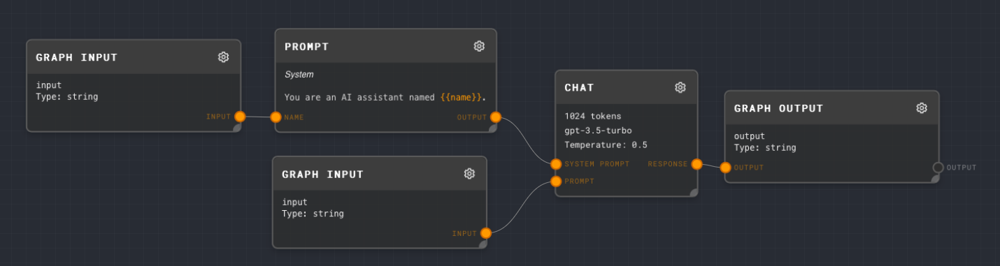
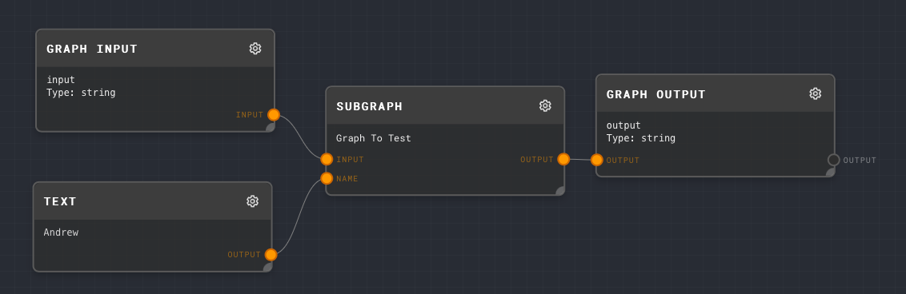
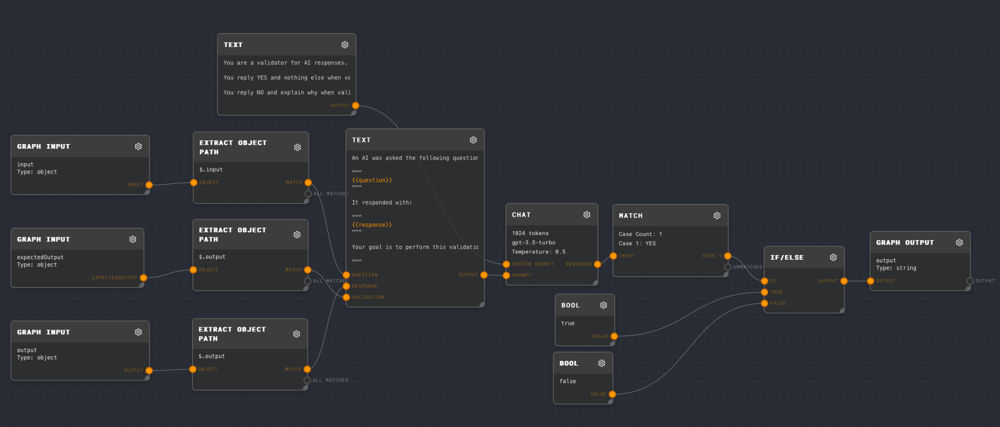
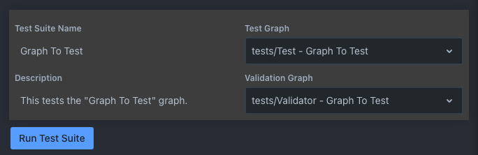

# Trivet - Tutorial

Suppose that we want to test a simple graph that executes a call against GPT-3.5, but that names the assistant:



Let's make a wrapper test graph, so that we don't need to pass the name of the assistant in every test case:



Next, let's make a validator graph. It must have `input`, `output`, and `expectedOutput` [Graph Input](../node-reference/graph-input) nodes, and they must all be of type Object. In this case, we will use all 3 input nodes.

We extract the validation question from the `expectedOutput`, and the actual output from `output`, and the question from `input`. We then ask GPT if the validation passes. The following prompt is used for this example:

```markdown
An AI was asked the following question:

"""
{{question}}
"""

The AI responded with:

"""
{{response}}
"""

Your goal is to perform this validation on the AI's response:

"""
{{validation}}
"""

Reply YES if the validation passes. Reply NO if the validation does not pass, and explain why.
```

With the following system prompt:

```
You are a validator for AI responses.

You reply YES and nothing else when validation pass.

You reply NO and explain why when validations do not pass.
```

The full validation graph looks as follows:



Next, let's make a test suite for this graph. Open the `Trivet Tests` tab and create a new test suite with the following configuration:



Add a new test case with the following configuration:


Note that for the input, you are asking GPT to perform the validation on this output, instead of validating the output directly. This is a useful pattern because you can check many more things than you can check programmatically, such as the tone and grammar strings!

Next, click the `Run Test Suite` button. You should see something like the following output appear in the test case editor:


Congratulations! You've just run your first Trivet test suite! You can add more tests to this suite, or create more test suites for other graphs.
